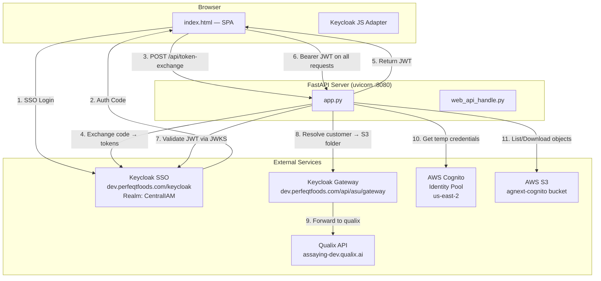
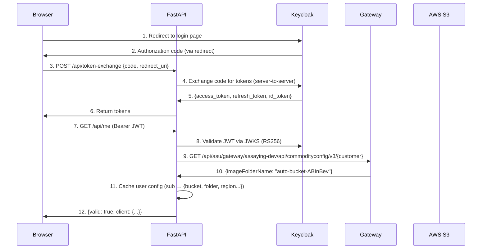

# AgNext S3 Download Manager — Architecture

## System Overview



---

## Authentication Flow



---

## Component Architecture

### Frontend (`index.html`)

Single-page application with 3-step wizard:

| Step | Description |
|------|-------------|
| **Step 1: Login** | Keycloak JS adapter handles SSO. Silent SSO check via iframe (`silent-check-sso.html`). On success, exchanges auth code for tokens via `/api/token-exchange`. |
| **Step 2: Browse** | Date range selector + multi-search (comma-separated OR logic). Two tabs: Samples (epoch folders) and Data Collection (expandable commodity tree). |
| **Step 3: Download** | File type filter checkboxes, organize-by-type toggle. SSE progress streaming during ZIP packaging. |

### Backend (`app.py`)

FastAPI application with dependency injection pattern:

| Layer | Role |
|-------|------|
| **Routes** | HTTP handlers — thin, delegate to helpers |
| **`get_current_user` (Depends)** | Auth middleware — validates JWT, returns user config or raises 401 |
| **`_get_session`** | Reusable JWT validation (returns None instead of raising, used by SSE) |
| **`_populate_user_cache`** | Resolves customer name + S3 folder via gateway on first access |
| **`_get_s3_resource`** | Creates boto3 S3 resource with Cognito temp credentials |
| **`user_cache`** | In-memory dict: Keycloak `sub` → user config (survives requests, cleared on logout/restart) |
| **`zip_store`** | In-memory dict: UUID token → BytesIO ZIP buffer (cleared after download) |

### API Layer (`web_api_handle.py`)

| Function | Purpose |
|----------|---------|
| `get_keycloak_public_config()` | Returns KC url/realm/clientId for frontend |
| `exchange_keycloak_code(code, redirect_uri)` | Server-side code→token exchange |
| `verify_keycloak_token(token)` | JWKS-based RS256 JWT validation |
| `get_customer_from_claims(claims)` | Multi-strategy customer name resolution from JWT |
| `fetch_s3_client_via_gateway(token, customer)` | Calls qualix API via KC gateway → returns `imageFolderName` |

---

## API Reference

### `GET /`

Serves the single-page frontend (`index.html`).

**Headers:** `Cache-Control: no-store`

---

### `GET /silent-check-sso.html`

Serves the Keycloak silent SSO check page (used by KC JS adapter's iframe).

---

### `GET /api/kc-config`

Returns Keycloak configuration for frontend initialization.

**Auth:** None required

**Response:**
```json
{
  "url": "https://dev.perfeqtfoods.com/keycloak",
  "realm": "CentralIAM",
  "clientId": "agnext-download-tool",
  "redirectUri": "http://localhost:8080/"
}
```

---

### `POST /api/token-exchange`

Exchange Keycloak authorization code for access/refresh tokens (server-side).

**Auth:** None required

**Request Body:**
```json
{
  "code": "abc123...",
  "redirect_uri": "http://localhost:8080/"
}
```

**Response:**
```json
{
  "access_token": "eyJ...",
  "refresh_token": "eyJ...",
  "id_token": "eyJ...",
  "expires_in": 300,
  "token_type": "Bearer"
}
```

**Errors:**
- `400` — Missing code or redirect_uri
- `401` — Invalid authorization code
- `500` — Keycloak unreachable

---

### `GET /api/me`

Validate JWT and return user info + S3 client config.

**Auth:** `Authorization: Bearer <access_token>`

**Response:**
```json
{
  "valid": true,
  "client": {
    "name": "abinbev",
    "first_name": "ABInBev Operator",
    "id": "auto-bucket-ABInBev",
    "type": "iot"
  }
}
```

**Errors:**
- `401` — Invalid or expired token

---

### `POST /api/logout`

Clear server-side user cache for the calling user.

**Auth:** `Authorization: Bearer <access_token>` (best-effort, token can be expired)

**Response:**
```json
{ "ok": true }
```

---

### `GET /api/files`

List S3 sample folders within date range + data collection folders.

**Auth:** `Authorization: Bearer <access_token>`

**Query Parameters:**

| Param | Type | Required | Description |
|-------|------|----------|-------------|
| `start_date` | string | Yes | `YYYY-MM-DD` |
| `end_date` | string | No | `YYYY-MM-DD` (defaults to end of start_date) |
| `filter` | string | No | File extension filter (e.g. `.json`) |

**Response:**
```json
{
  "files": [
    {
      "key": "visio_desktop/auto-bucket-ABInBev/1716970000000_RICE/",
      "name": "1716970000000_RICE",
      "date": "2024-05-29 10:26",
      "source": "samples"
    }
  ],
  "total": 42,
  "data_collection": [
    {
      "key": "visio_desktop/auto-bucket-ABInBev/data_collection/barley/Broken/",
      "name": "barley/Broken",
      "date": "",
      "source": "data_collection"
    }
  ],
  "dc_total": 8
}
```

**Logic:**
1. Parse epoch timestamps from folder names (e.g. `1716970000000_RICE`)
2. Filter folders where epoch falls within [start_date IST, end_date IST]
3. Separately scan `data_collection/{commodity}/{subfolder}/` structure
4. Return both lists sorted (samples desc by name, DC asc by name)

**Errors:**
- `401` — Unauthorized
- `422` — Missing start_date

---

### `GET /api/dc-expand`

Expand a data collection subfolder to show its children (sub-subfolders + files).

**Auth:** `Authorization: Bearer <access_token>`

**Query Parameters:**

| Param | Type | Required | Description |
|-------|------|----------|-------------|
| `prefix` | string | Yes | S3 prefix to expand (e.g. `visio_desktop/.../barley/Broken/`) |

**Response:**
```json
{
  "subfolders": [
    { "key": "...prefix.../subfolder/", "name": "subfolder", "type": "folder" }
  ],
  "files": [
    { "key": "...prefix.../image.jpg", "name": "image.jpg", "size": 45231, "type": "file" }
  ],
  "total": 15
}
```

**Security:** Validates that `prefix` starts with the authenticated user's data_collection path.

**Errors:**
- `400` — Missing prefix
- `401` — Unauthorized
- `403` — Prefix doesn't belong to user
- `502` — S3 error

---

### `GET /api/download/prepare`

Package selected S3 folders into a ZIP while streaming SSE progress events.

**Auth:** `Authorization: Bearer <access_token>` (validated manually for SSE compatibility)

**Query Parameters:**

| Param | Type | Required | Description |
|-------|------|----------|-------------|
| `keys` | string | Yes | Comma-separated S3 prefixes to download |
| `organize_by_type` | string | No | `"1"` to organize ZIP by file extension |
| `file_types` | string | No | Comma-separated type filters (e.g. `images,csv,json`) |

**Response:** `text/event-stream` (SSE)

```
data: {"type":"log","cls":"info","msg":"[INFO] Connecting to S3..."}

data: {"type":"log","cls":"info","msg":"[INFO] Packaging 3 folder(s), 47 file(s) into ZIP..."}

data: {"type":"progress","done":1,"total":47,"pct":2,"cls":"ok","msg":"[OK] 1716970000000_RICE/image1.jpg"}

data: {"type":"log","cls":"err","msg":"[FAIL] some_file.dat: AccessDenied"}

data: {"type":"ready","token":"uuid-download-token","done":46,"failed":1,"total":47}
```

**SSE Event Types:**

| Type | Description |
|------|-------------|
| `log` | Informational message (cls: `info` or `err`) |
| `progress` | File downloaded successfully (includes done/total/pct) |
| `error` | Fatal error — stream ends |
| `ready` | ZIP is packaged — contains `token` for download |

**ZIP Organization (when `organize_by_type=1`):**
```
samples/
  images/
    1716970000000_RICE/photo.jpg
  json/
    1716970000000_RICE/metadata.json
data_collection/
  images/
    barley/Broken/grain1.png
  csv/
    barley/Broken/results.csv
```

---

### `GET /api/download/get`

Serve the pre-packaged ZIP file by token.

**Auth:** `Authorization: Bearer <access_token>`

**Query Parameters:**

| Param | Type | Required | Description |
|-------|------|----------|-------------|
| `token` | string | Yes | Download token from `/api/download/prepare` |

**Response:** `application/zip` binary stream

**Headers:** `Content-Disposition: attachment; filename="auto-bucket-ABInBev_20260609_143022.zip"`

**Errors:**
- `401` — Unauthorized
- `404` — Invalid or expired token (token is single-use)

---

## S3 Structure

```
agnext-cognito/
└── visio_desktop/
    └── {imageFolderName}/                    ← per-customer (e.g. auto-bucket-ABInBev)
        ├── {epoch_ms}_{sampleId}/            ← sample folders
        │   ├── image1.jpg
        │   ├── metadata.json
        │   └── results.csv
        ├── {epoch_ms}_{sampleId}/
        │   └── ...
        └── data_collection/
            ├── {commodity}/                  ← e.g. barley, wheat
            │   ├── {category}/              ← e.g. Broken, Clean
            │   │   ├── {subfolder}/
            │   │   │   ├── image.png
            │   │   │   └── ...
            │   │   └── loose_file.jpg
            │   └── {category}/
            └── {commodity}/
```

---

## Configuration (`config.INI`)

| Section | Key | Description |
|---------|-----|-------------|
| `CONFIG_SETTINGS` | `run_env` | `dev` / `qa` / `prod` — selects API base URL |
| `API_ENV` | `dev`, `qa`, `prod` | Base URLs for qualix API |
| `API_URI` | `client_config_url` | Qualix commodity-config endpoint path |
| `S3` | `bucket` | S3 bucket name |
| `S3` | `bucket_folder` | Root prefix in bucket |
| `S3` | `region` | AWS region |
| `S3` | `pool_id` | Cognito Identity Pool ID |
| `S3` | `type` | Device type for API query |
| `KEYCLOAK` | `server_url` | Keycloak base URL |
| `KEYCLOAK` | `realm` | Keycloak realm name |
| `KEYCLOAK` | `client_id` | Keycloak client ID (public client) |
| `KEYCLOAK` | `redirect_uri` | OAuth redirect URI |
| `KEYCLOAK` | `gateway_url` | Gateway base URL for API calls |
| `KEYCLOAK` | `gateway_service` | Service name in gateway path |
| `KEYCLOAK` | `customer_claim` | JWT claim for customer name (optional) |

---

## Deployment

### Docker

```dockerfile
FROM python:3.11-slim
CMD ["uvicorn", "app:app", "--host", "0.0.0.0", "--port", "8080", "--workers", "1", "--timeout-keep-alive", "300"]
```

**Single worker required** — `user_cache` and `zip_store` are in-memory dicts shared across requests. Multiple workers would create isolated memory spaces.

### docker-compose

```yaml
services:
  web:
    build: .
    ports:
      - "8080:8080"
    volumes:
      - ./config.INI:/app/config.INI
      - ./logs:/app/logs
    restart: unless-stopped
```

### Local Development

```bash
pip install -r requirements.txt
uvicorn app:app --host 127.0.0.1 --port 8080 --reload
```

---

## Tech Stack

| Component | Technology |
|-----------|------------|
| Backend Framework | FastAPI 0.111+ |
| ASGI Server | Uvicorn |
| Authentication | Keycloak SSO (RS256 JWT via JWKS) |
| Cloud Storage | AWS S3 via Cognito Identity Pool |
| API Gateway | Keycloak Gateway (dev.perfeqtfoods.com) |
| Frontend | Vanilla HTML/CSS/JS (single-page) |
| Streaming | Server-Sent Events (SSE) |
| Packaging | Python zipfile (in-memory) |
| Containerization | Docker + docker-compose |

---

## Security Model

1. **No secrets in frontend** — Keycloak public client (no client_secret)
2. **JWT validation** — RS256 via JWKS endpoint, with expiry + clock skew tolerance
3. **Path traversal prevention** — S3 prefix validated against user's authorized folder
4. **Single-use download tokens** — UUID tokens cleared from memory after serving
5. **Gateway authorization** — qualix API access verified per-user through KC gateway
6. **No credential storage** — Cognito temp credentials expire automatically
7. **CORS** — Not configured (same-origin only by default)
